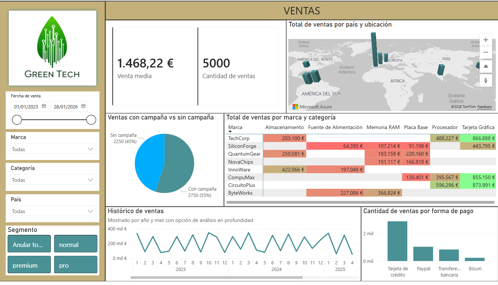
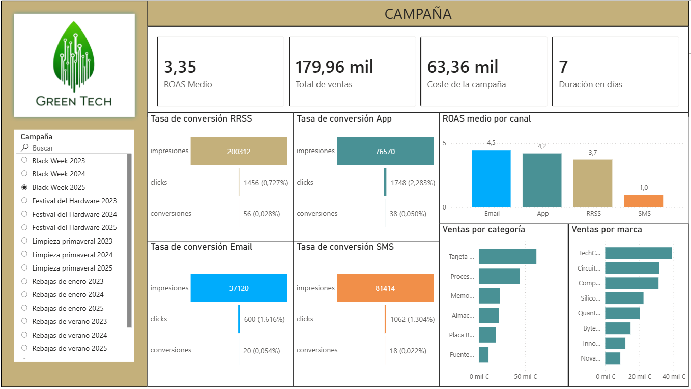
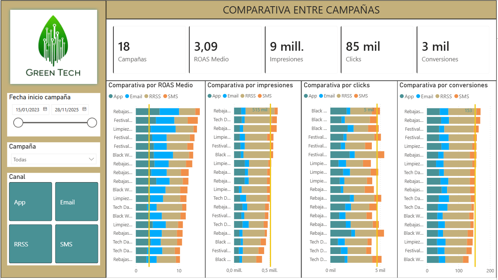
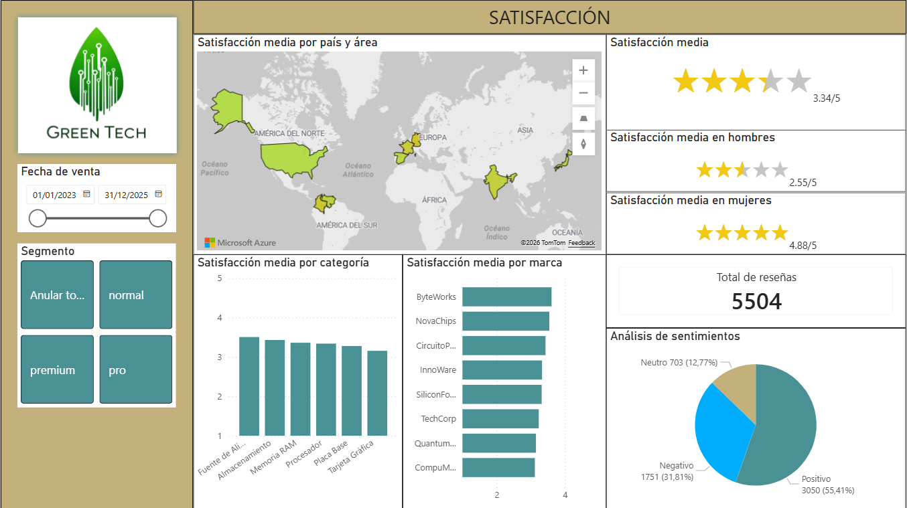

# Green Tech Business Analytics Dashboard

## Executive Summary

This project presents an end-to-end business analytics solution developed for **Green Tech**, a technology company, using Power BI. The objective is to provide a comprehensive view of business performance by integrating **sales analysis, marketing campaign effectiveness, and customer satisfaction insights** into a unified reporting framework.

---

## 1. Sales Performance

The sales dashboard provides a global overview of revenue distribution, average sales value (€1.46K), and transaction volume (5,000 sales). It highlights geographical performance, category-level trends, and brand contributions.

A key insight is the comparison between sales with and without marketing campaigns. Campaign-driven sales represent approximately **55% of total sales**, indicating a strong reliance on marketing initiatives to drive revenue.

---

## 2. Marketing Campaign Analysis

The campaign dashboard provides a comprehensive view of marketing performance by analyzing Return on Ad Spend (ROAS), conversion funnels, and channel effectiveness across different campaigns.

The dashboard enables evaluation of performance by channel, showing clear differences in efficiency:
- **Email and App channels** consistently deliver higher returns
- **SMS shows significantly lower performance**, indicating potential inefficiencies

Additionally, the conversion funnel visualization allows users to track user behavior from impressions to conversions, helping identify drop-off points and optimization opportunities.

Overall, this dashboard supports a deeper understanding of how different marketing channels contribute to revenue generation and campaign success.

---

## 3. Campaign Comparison

This section compares multiple campaigns across key performance indicators such as ROAS, impressions, clicks, and conversions.

The analysis reveals variability in performance across campaigns, enabling the identification of:
- High-performing campaigns suitable for scaling
- Underperforming campaigns requiring optimization or budget reallocation

This comparative approach supports more effective and data-driven marketing decisions.

---

## 4. Customer Satisfaction & Sentiment Analysis

The satisfaction dashboard provides a comprehensive analysis of customer experience across regions, product categories, brands, and customer segments.

- Average satisfaction: **3.34 / 5**
- Female satisfaction: **4.88 / 5**
- Male satisfaction: **2.55 / 5**
- Total reviews: **5,504**

The geographic distribution highlights customer satisfaction across key markets, including North America, Europe, and Asia.

Category-level analysis shows that **Power Supply and Storage products achieve the highest satisfaction levels**, followed by RAM, processors, and other hardware components.

Brand analysis reveals relatively consistent performance across multiple manufacturers, suggesting moderate differentiation in perceived quality.

Sentiment distribution:
- Positive: **55%**
- Negative: **32%**
- Neutral: **13%**

Despite a majority of positive reviews, the dashboard reveals two critical insights:
- A **significant gender gap in satisfaction**, with notably lower scores among male customers  
- A **substantial proportion of negative feedback**, indicating clear opportunities for improving customer experience  

---

## Key Insights

- Business performance is highly dependent on marketing campaigns  
- Email and App are the most efficient channels in terms of ROI  
- There is a conversion gap in high-reach channels  
- Customer satisfaction is uneven across segments, with a notable gender disparity  
- Negative feedback remains significant despite overall positive sentiment  

---

## Business Impact

This dashboard enables:

- Improved marketing budget allocation  
- Identification of high-performing channels and campaigns  
- Detection of customer experience gaps  
- Alignment between sales, marketing, and customer satisfaction metrics  

Overall, it supports a more data-driven and customer-centric decision-making process.

---

## Tools & Skills

- Power BI  
- Data Modeling  
- DAX  
- Data Visualization  
- Business Analysis  

---

## Note

The dashboard content is presented in Spanish, while the analysis and documentation are provided in English to demonstrate proficiency in a professional, international context.
